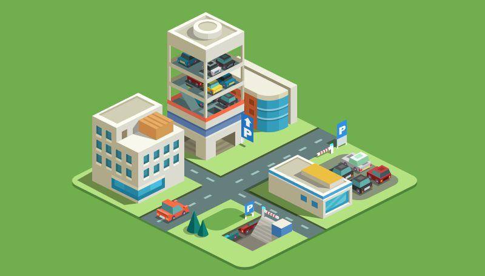
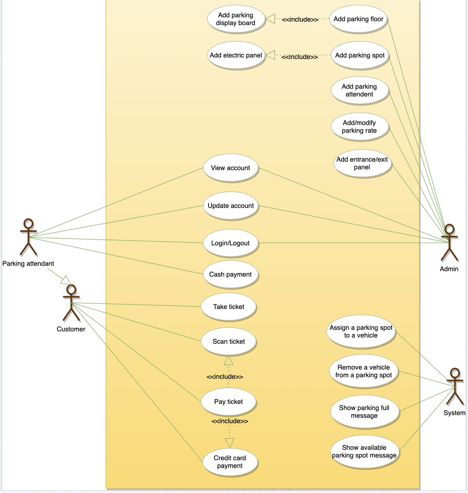
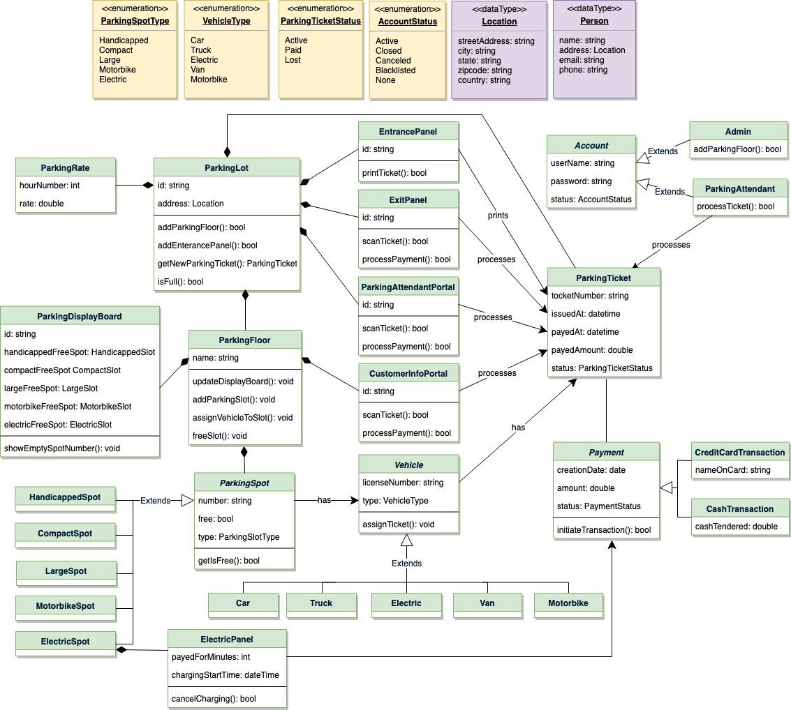
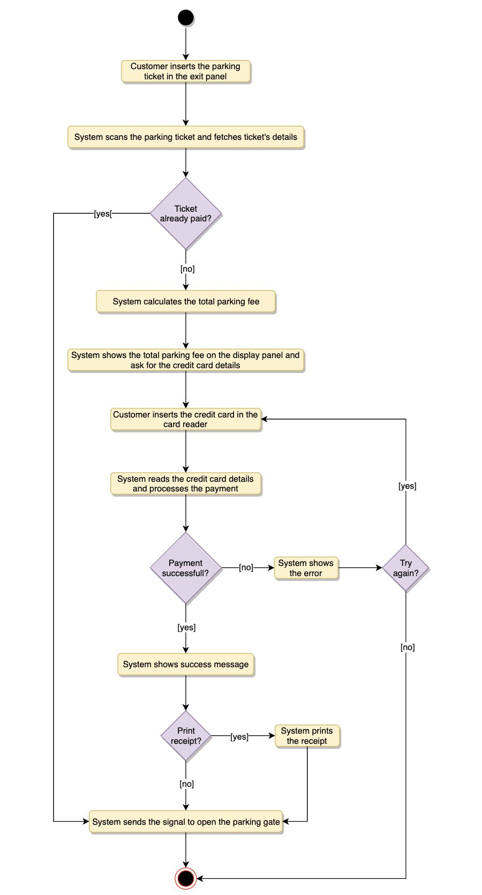

# Parking Lot System Design
**Educative**

---

## System Requirements

We will focus on the following set of requirements while designing the parking lot:

*   The parking lot should have multiple floors where customers can park their cars.
*   The parking lot should have multiple entry and exit points.
*   Customers can collect a parking ticket from the entry points and can pay the parking fee at the exit points on their way out.
*   Customers can pay the tickets at the automated exit panel or to the parking attendant.
*   Customers can pay via both cash and credit cards.
*   Customers should also be able to pay the parking fee at the customer’s info portal on each floor. If the customer has paid at the info portal, they don’t have to pay at the exit.
*   The system should not allow more vehicles than the maximum capacity of the parking lot. If the parking is full, the system should be able to show a message at the entrance panel and on the parking display board on the ground floor.
*   Each parking floor will have many parking spots. The system should support multiple types of parking spots such as Compact, Large, Handicapped, Motorcycle, etc.
*   The parking lot should have some parking spots specified for electric cars. These spots should have an electric panel through which customers can pay and charge their vehicles.
*   The system should support parking for different types of vehicles like cars, trucks, vans, motorcycles, etc.
*   Each parking floor should have a display board showing any free parking spots for each spot type.
*   The system should support a per-hour parking fee model. For example, customers have to pay $4 for the first hour, $3.5 for the second and third hours, and $2.5 for all the remaining hours.

---

## Use Case Diagram

### Main Actors
*   **Admin:** Responsible for adding and modifying parking floors, parking spots, entrance, and exit panels, adding/removing parking attendants, etc.
*   **Customer:** Customers can get a parking ticket and pay for it.
*   **Parking Attendant:** Can perform all activities on the customer’s behalf and can accept cash for ticket payments.
*   **System:** Displays messages on different info panels, assigns, and removes vehicles from parking spots.

### Top Use Cases
*   **Add/Remove/Edit parking floor:** Add, remove or modify a parking floor. Each floor can have its own display board to show free parking spots.
*   **Add/Remove/Edit parking spot:** Add, remove or modify a parking spot on a parking floor.
*   **Add/Remove a parking attendant:** Add or remove a parking attendant from the system.
*   **Take ticket:** Provide customers with a new parking ticket when entering the parking lot.
*   **Scan ticket:** Scan a ticket to find out the total charge.
*   **Credit card payment:** Pay the ticket fee with a credit card.
*   **Cash payment:** Pay the parking ticket with cash.
*   **Add/Modify parking rate:** Admins can add or modify the hourly parking rate.

---

## Class Diagram

Here are the main classes of our Parking Lot System:

*   **ParkingLot:** The central entity. Attributes include ‘Name’ and ‘Address’ to distinguish between different parking lots.
*   **ParkingFloor:** Represents a floor in the parking lot, each containing several parking spots.
*   **ParkingSpot:** Each floor will have multiple spots. Our system supports types: Handicapped, Compact, Large, Motorcycle, and Electric.
*   **Account:** Two types of accounts: Admin and Parking Attendant.
*   **ParkingTicket:** Encapsulates a parking ticket. Customers will take a ticket upon entering the parking lot.
*   **Vehicle:** Supports different vehicle types: Car, Truck, Electric, Van, and Motorcycle.
*   **EntrancePanel and ExitPanel:** EntrancePanel prints tickets, while ExitPanel facilitates ticket payment.
*   **Payment:** Responsible for processing payments. The system supports both credit card and cash transactions.
*   **ParkingRate:** Tracks hourly parking rates, specifying costs for each hour.
*   **ParkingDisplayBoard:** Each parking floor will have a display board to show available spots.
*   **ParkingAttendantPortal:** Encapsulates operations that an attendant can perform, such as scanning tickets and processing payments.
*   **CustomerInfoPortal:** Allows customers to pay for tickets, updating the ticket status to reflect payment.
*   **ElectricPanel:** Allows customers to charge electric vehicles and make payments.

---

## Activity Diagram

### Customer paying for parking ticket:
Here are the steps for a customer to pay the parking fee:

1.  Get the parking ticket at the entrance.
2.  Park the vehicle.
3.  Before exiting, the customer can either pay at the customer info portal or at the exit panel.
4.  If the customer pays at the info portal, the system marks the ticket as paid.
5.  The customer exits by scanning the ticket at the exit.

